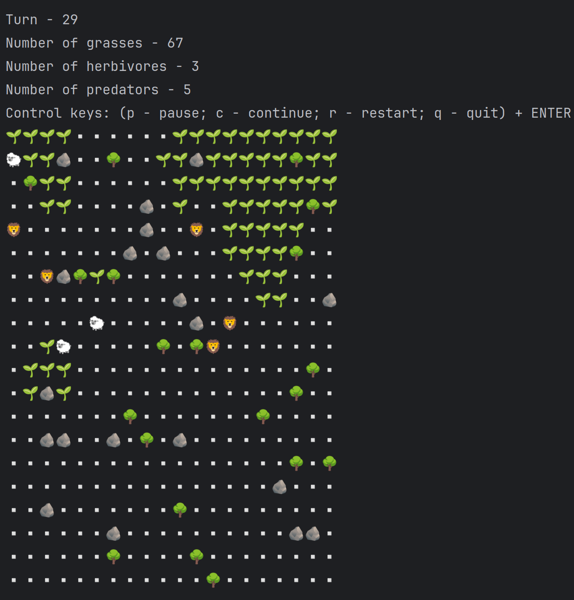

# Simulation
## Цель проекта
- Отработать ООП
- Ознакомление с паттерном «Команда»

## О проекте
Проект из RoadMap'а Сергея Жукова

Проект представляет собой симуляцию жизни, в которой есть следующие сущности:
- Камни и деревья — препятствия для передвигающихся объектов;
- Трава — пища для травоядных. Имеет возможность к фотосинтезу, что позволяет расти на соседних клетках;
- Травоядные — передвигающееся существо, имеющее здоровье. Цель данного существа — найти траву, чтобы съесть её и повысить своё здоровье;
- Хищники — передвигающееся существо, которое также имеет здоровье. Цель хищника — найти травоядного и «откусить» от него кусок;

## Правила
Создаётся карта, на которой располагаются все сущности.
Симуляция обновляется каждые 2 секунды.
На экран выводится следующая информация:
- Номер итерации симуляции;
- Количество травы;
- Количество травоядных;
- Количество хищников;
- Правила для управления симуляцией.

После выводится сам результат симуляции с помощью эмодзи.
Для корректного вывода симуляции желательно использовать моноширинный шрифт с резервным шрифтом «Noto Color Emoji».

## Процесс работы симуляции:
- Старт симуляции:
  - Старт вспомогательного потока для отслеживания нажатых клавиш (поток работает, пока симуляция активна);
  - Инициализация карты с помощью генерации заданного количества сущностей в случайных местах;
  - Запуск главного цикла симуляции.
- Каждая итерация симуляции:
  - Обновление информирующей доски;
  - В очередь команд отправляются команды, которые заставляют травоядных и хищников сделать ход;
  - Травоядные и хищники ищут самый короткий путь до ближайшей цели с помощью алгоритма A*;
  - Отправляется команда для фотосинтеза каждой травы с определённым шансом (чем больше объектов на карте, тем меньше шанс фотосинтеза и наоборот).
- Вспомогательный поток:
  - При вводе требуемых клавиш и нажатии Enter программа выполняет действие:
    - 'p' — pause;
    - 'c' — continue;
    - 'r' — restart;
    - 'q' — quit.